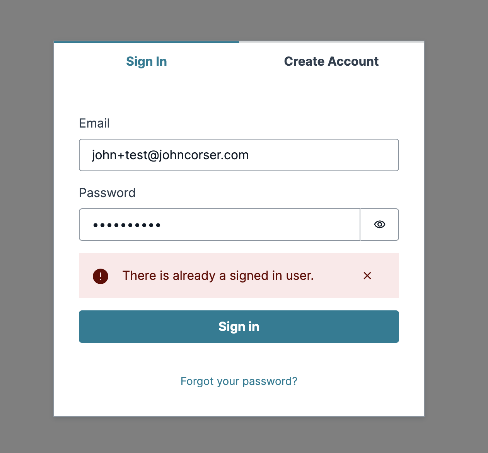

# Authenticator error repro

This is a demo repo showing issues with the Authenticator component combined with a preSignUp lamba trigger.

1. If using `autoConfirmUser` in preSignUp, you get "stuck" in the authenticator component after signing up
2. The preSignUp lambda executes twice (apparently to due to `OPTIONS` and `POST` calls) which is dangerous as setup-y stuff is only supposed to happen once
3. The preSignUp lambda will always time out unless `context.callbackWaitsForEmptyEventLoop = false;` is set in the lambda

Live demo is availble (for now) at: [https://main.d1q2mvk8vhrxl0.amplifyapp.com](https://main.d1q2mvk8vhrxl0.amplifyapp.com).

## Authenticator UI Error

```bash
npm install # Install node dependencies
npx amplify sandbox # Deploy backend resources
npm run dev # Start nextjs server
```

Open [http://localhost:3000](http://localhost:3000) with your browser. You will see the Authenticator component.

**Bug #1:** Attempt to sign up - Notice that instead of automatically logging you in after signup, it simply redirects back to the "sign in" flow.

**Bug #2:** Attempt to sign in. You'll see an error message `There is already a signed in user.` as in screenshot below:



## Lambda Trigger Runs Twice Error

After attempting sign up, visit your lambda trigger logs in CloudWatch. You see two invocations of the pre sign up trigger, even though you only signed up once.

This appears to be because both the OPTIONS call and the POST call result in the pre signup trigger being invoked.

This is dangerous, because presignup triggers are often used to set up data in the database, and running that setup twice in a row can result in unexpected behavior.

## Lambda trigger does not have empty event loop by default

Notice in `./amplify/auth/pre-signup-handler.ts` there is a strange line that I've included:

```javascript
context.callbackWaitsForEmptyEventLoop = false;
```

Without this line, the sign up process times out after 3 seconds. Try it yourself by removing that line and re-running:

```bash
npx amplify sandbox
```

For some reason, the lamba event loop is not empty by default in the preSignUp lambda. This causes the response callback to not happen, so the timeout error occurrs.

I don't understand why that would be, and I didn't find any documentation pointing from Amplify explaining what's going on or how to work around it.
